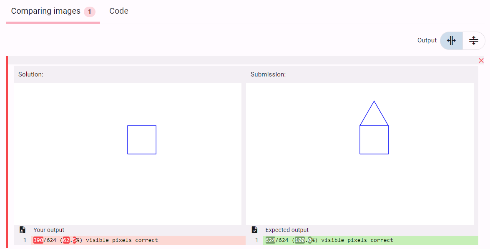

# Python Turtle for [Dodona](https://dodona.ugent.be/)

> ***Python Turtle** graphics is a popular way for introducing programming to kids. This judge aims to provide **feedback** for these students during the learning experience and evaluations. How similar is the submission of the student to the solution of the teacher?*
>
> 
>
> This Dodona course contains some sample exercises that were used in developing the Python Turtle judge:
>
> * <https://dodona.ugent.be/en/courses/TODO/>
>
> There are a number of sample exercises on Dodona's sample exercises repository to demonstrate the use of the judge:
>
> * <https://github.com/dodona-edu/example-exercises>  # TODO
>

## Table of Contents

* [Recommended exercise directory structure](#recommended-exercise-directory-structure)
* [Recommended `dirconfig.json`](#recommended-dirconfigjson)
* [Recommended `config.json` (example with default settings)](#recommended-configjson-example-with-default-settings)
* [Optional `evaluation` settings in `config.json`](#optional-evaluation-settings-in-configjson)
* [Generator script](#generator-script)
* [Contributors](#contributors)

### Judge features

* Comparison based on solution Python file
* Submission and solution image shown side-by-side
* Absolute difference and percentage of mismatched visible (non-transparant) pixels.
* Option to set custom canvas size in `config.json`
* Feedback in language of user (Dutch or English)

### Judge properties

* `print()` statements and `time.sleep()` are ignored.
* No intermediary steps ar shown. Only the end result is compared.
* Judge accepts solution independent of code. The judge doesn't make a destination between e.g. square drawn with for-loop or not. If a figure is drawn clockwise or counterclockwise it's treated equally.
* Support for transparency.
* Script available to convert `solution.py` to svg image for exercise description.

## Recommended exercise directory structure

> [More info about repository directory structure](https://docs.dodona.be/en/references/repository-directory-structure/#example-of-a-valid-repository-structure)

Add your solution file (`solution.py`) the **`evaluation`** folder. You can define a different name for the solution in the `config.json` file. Absolute
necessary files are marked with `▶` in the tree structure below.

```text
+-- README.md                            # Optional: Describes the repository
+-- dirconfig.json                       # Shared config for all exercises in subdirs
+-- 📂public                            # Optional: Contains files that belong to the course or series
|   +-- my_turtle.png                    # Optional: An image to reuse throughout the course
+-- 📂turtle-exercises                  # We could group exercises in a folder
|   +-- 📂rectangle                     # Folder name for the exercise
|   |   +-- config.json                  # ▶ Configuration of the exercise (explained later)
|   |   +-- 📂evaluation                # -- 🔽️ ADD YOUR SOLUTION HERE 🔽 --
|   |   |   +-- solution.py              # ▶ The Python Turtle model solution file
|   |   +-- 📂solution                  # Optional: This will be visible in Dodona for teachers
|   |   |   +-- solution.sql             # Optional: The Python Turtle model solution file
|   |   +-- 📂description               #
|   |       +-- description.nl.md        # ▶ The description in Dutch
|   |       +-- description.en.md        # Optional: The description in English
|   |       +-- 📂media                 # Optional folder
|   |       |   +-- rectangle.svg       # Optional: An image used in the description
|   |       +-- 📂boilerplate           # Optional folder
|   |           +-- boilerplate          # Optional: loaded automatically in submission text area
|   :
:
```

## Recommended `dirconfig.json`

> [More info about exercise directory structure](https://docs.dodona.be/en/references/exercise-directory-structure/)

```json
{
    "type": "exercise",
    "programming_language": "python",
    "access": "public",
    "evaluation": {
        "handler": "turtle",
        "time_limit": 10
    },
    "labels": [
        "turtle"
    ],
    "author": "Firstname Lastname <firstname_lastname@ugent.be>",
    "contact": "firstname_lastname@ugent.be"
}
```

## Recommended `config.json` (example with default settings)

```json
{
    "description": {
        "names": {
            "nl": "Mijn eerste Python Turtle oefening",
            "en": "My first Python Turtle exercise"
        }
    },
    "type": "exercise",
    "programming_language": "turtle",
    "access": "public",
    "labels": [
        "turtle"
    ],
    "evaluation": {
        "handler": "turtle",
        "canvas_width": 400,
        "canvas_height": 250
    }
}
```

## Optional `evaluation` settings in `config.json`

If these settings are not defined, the default value is chosen.

| Evaluation setting | Description                    | Possible values | Default         |
|--------------------|--------------------------------|-----------------|-----------------|
| `solution_file`    | Relative path to solution file | path            | `./solution.py` |
| `canvas_width`     | Width of canvas in pixels      | int             | `400`           |
| `canvas_height`    | Height of canvas in pixels     | int             | `250`           |

## Generator script

The svg images for each exercise can be made with a Python script. Place the script at the root of your folder with exercises.

````python
# TODO
````

#### Show svg image in Dodona description

* Markdown (recommended)

```markdown
{:height="50%" width="50%"}{: style="border-style: inset"}
```

* HTML

```html

```

## Contributors

* **T. Ramlot**
* B. Willems

*Development funded by the [Faculty of Engineering and Architecture](https://www.ugent.be/ea/en)
of [Ghent University](https://www.ugent.be/en)*
